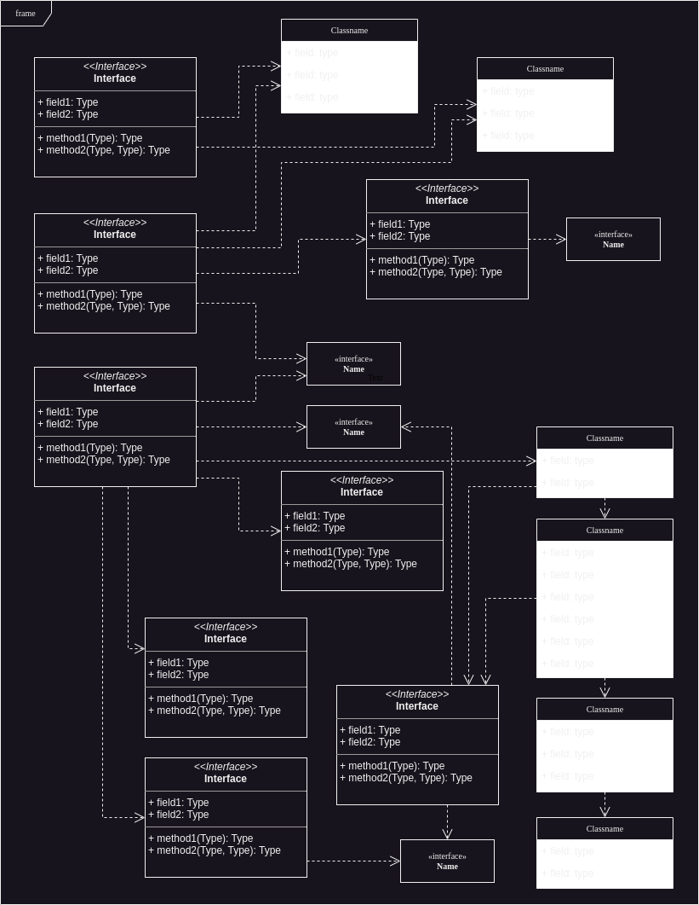

# Siemens-EDA-OOP-5G-Analyzer-Emulator
This is a C++ based project which emulate the 5G packet analyzer by parsing input file of raw packets and produce output human-readable-analysis in a file.

# To build the project
```
chmod +x app.sh
./app.sh build
./app run
```

Note: Sometimes, you may have to use ```sudo``` with ```chmod +x app.sh```

# UML Design


# Contributors
1. Ahmed Alaa El-Sayed Arabi Zidan
2. Fady Maged
3. Hazem Adel