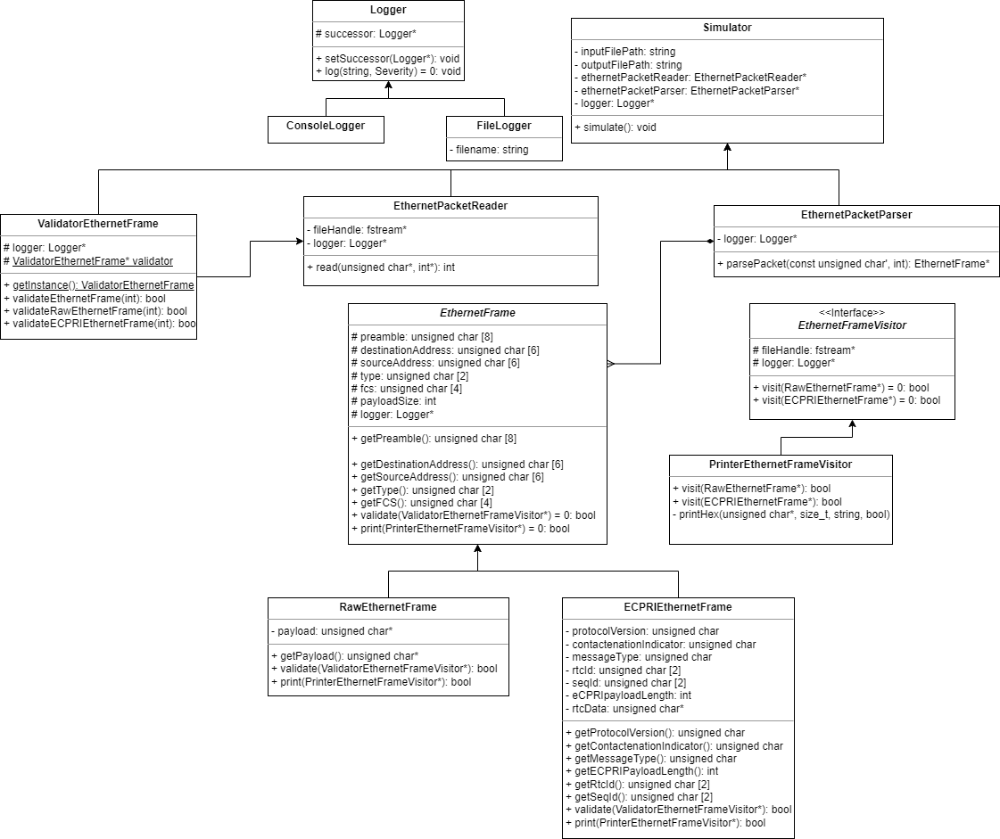

# Siemens-EDA-OOP-5G-Analyzer-Emulator

This is a C++ based project which emulate the 5G packet analyzer by parsing input file of raw packets and produce output human-readable-analysis in a file.

# To build the project

```
chmod +x app.sh
./app.sh build
./app run
```

Note: Sometimes, you may have to use `sudo` with `chmod +x app.sh`

# UML Design



# Terminologies

1. Ethernet Packet Frame:

   - <span style="color: green;">Preamble</span>: is a sequence of alternating 1s and 0s that helps the receiving device synchronize its clock with the transmitting device.

   - <span style="color: green;">Destination Address</span>: contains the MAC address of the intended recipient of the Ethernet frame packet.

   - <span style="color: green;">Source Address</span>: contains the MAC address of the device that is transmitting the Ethernet frame packet.

   - <span style="color: green;">Types</span>: specifies the protocol type of the data in the payload section. It indicates the upper-layer protocol to which the data should be passed.

   - <span style="color: green;">Payload (Data)</span>: carries the actual data being transmitted. It can vary in size and content depending on the specific application or protocol being used. The payload can be a raw ethernet or e-CPRI frame depending on the Type field, it will be e-CIPRI fram if the Type is `AEFE`

   - <span style="color: green;">FCS (Frame Check Sequence)</span>: contains a checksum value calculated over the entire Ethernet frame, including all the preceding fields. It is used to detect errors in the transmission and ensure data integrity.

2. e-CPRI Packet Frame:

   - <span style="color: green;">eCPRI Protocol Revision</span>: identifies the version of the eCPRI protocol being used for the transmission. It helps ensure compatibility between different devices and software versions.

   - <span style="color: green;">C</span>: is a reserved bit that is used for future expansion of the protocol. It is currently set to 0.

   - <span style="color: green;">eCPRI Message Type</span>: specifies the type of message being transmitted in the eCPRI packet frame. There are several different message types defined in the eCPRI standard, each with its own specific format and purpose.

   - <span style="color: green;">eCPRI Payload Size</span>: specifies the size of the payload data being transmitted in the current eCPRI packet frame. This helps the receiving device know how much data to expect and how to process it.

   - <span style="color: green;">RTC_ID</span>: RTC stands for Real-Time Control, and the RTC_ID field is a unique identifier that is used to identify a specific instance of real-time control data. This identifier helps ensure that the correct data is being processed and acted upon by the receiving device.

   - <span style="color: green;">SEQ_ID</span>: is used to indicate the sequence number of the real-time control data being transmitted. This helps the receiving device keep track of the order in which the data was sent and detect any missing or out-of-order packets.

   - <span style="color: green;">Real-Time Control Data</span>: refers to any data that is used to control a system or process in real-time. Examples of real-time control data could include sensor readings, control signals, or other types of data that are used to monitor or adjust a system in real-time. The specific format and content of the real-time control data can vary depending on the application or system being used.

# Classes Categories

0. Simulator -> Ahmed Alaa
1. PacketReader -> Fady Maged
2. PacketParser -> Ahmed Alaa
3. PacketValidatorVisitor (Ethernet or eCPRI) -> Hazem Adel
4. PackerPrinterVisitor (Ethernet or eCPRI) -> Fady Maged
5. Logger (Ethernet or eCPRI) -> Ahmed Alaa

---

6. UnitTestClass (...) -> Together

# Design Patterns Used

1. Singleton -> Logger
2. Vistor ->
3. Strategy

# Implementation Notes

```C++
Logger logger;
RawEthernetPacketReader rawEthernetPacketReader(..., &logger);
```

# Data Flow

Simulation Object {
Logger logger;
Reader reader(logger);
Parser packetParser(logger);
Printer printer(logger);

    simulate {
        while (reader.read(packer)) {
            EthernetFrame *ethernetFrame = packetParser.parse(packer); // all of the data members except payload
            printer.print(ethernetFrame);
        }
    }

}

# Contributors

1. Ahmed Alaa El-Sayed Arabi Zidan
2. Fady Maged
3. Hazem Adel
