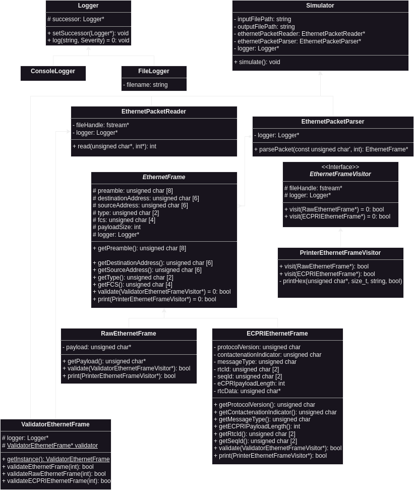

# Siemens-EDA-OOP-5G-Analyzer-Emulator

This is a C++-based project that emulates the 5G packet analyzer by parsing the input file of raw packets and producing output human-readable-analysis in a file.

# To build the project

## On Linux or MacOS
```
chmod +x app.sh
./app.sh build
./app run
```
**Note:** Sometimes, you may have to use `sudo` with `chmod +x app.sh`

## On windows
You can use git bash to run on Linux, but in case you face any problems, you can do the following:
```
mkdir -p build
cd build
cmake .. -G "MinGW Makefiles"
make
```
**Note:** We implemented a logger and it is enabled by default, to disable it you can set the macro (DISABLE_LOGGING) in Include/Logger/Logger.h to 1


# UML Design



# Terminologies

1. Ethernet Packet Frame:

   - <span style="color: green;">Preamble</span>: is a sequence of alternating 1s and 0s that helps the receiving device synchronize its clock with the transmitting device.

   - <span style="color: green;">Destination Address</span>: contains the MAC address of the intended recipient of the Ethernet frame packet.

   - <span style="color: green;">Source Address</span>: contains the MAC address of the device that is transmitting the Ethernet frame packet.

   - <span style="color: green;">Types</span>: specifies the protocol type of the data in the payload section. It indicates the upper-layer protocol to which the data should be passed.

   - <span style="color: green;">Payload (Data)</span>: carries the actual data being transmitted. It can vary in size and content depending on the specific application or protocol being used. The payload can be a raw ethernet or e-CPRI frame depending on the Type field, it will be an e-CIPRI frame if the Type is `AEFE`

   - <span style="color: green;">FCS (Frame Check Sequence)</span>: contains a checksum value calculated over the entire Ethernet frame, including all the preceding fields. It is used to detect errors in the transmission and ensure data integrity.

2. e-CPRI Packet Frame:

   - <span style="color: green;">eCPRI Protocol Revision</span>: identifies the version of the eCPRI protocol being used for the transmission. It helps ensure compatibility between different devices and software versions.

   - <span style="color: green;">C</span>: is a reserved bit that is used for future expansion of the protocol. It is currently set to 0.

   - <span style="color: green;">eCPRI Message Type</span>: specifies the type of message being transmitted in the eCPRI packet frame. There are several different message types defined in the eCPRI standard, each with its own specific format and purpose.

   - <span style="color: green;">eCPRI Payload Size</span>: specifies the size of the payload data being transmitted in the current eCPRI packet frame. This helps the receiving device know how much data to expect and how to process it.

   - <span style="color: green;">RTC_ID</span>: RTC stands for Real-Time Control, and the RTC_ID field is a unique identifier that is used to identify a specific instance of real-time control data. This identifier helps ensure that the correct data is being processed and acted upon by the receiving device.

   - <span style="color: green;">SEQ_ID</span>: is used to indicate the sequence number of the real-time control data being transmitted. This helps the receiving device keep track of the order in which the data was sent and detect any missing or out-of-order packets.

   - <span style="color: green;">Real-Time Control Data</span>: refers to any data that is used to control a system or process in real-time. Examples of real-time control data could include sensor readings, control signals, or other types of data that are used to monitor or adjust a system in real time. The specific format and content of the real-time control data can vary depending on the application or system being used.

# Classes
1. Simulator -> Ahmed Alaa
2. PacketReader -> Fady Maged
3. PacketParser -> Ahmed Alaa
4. EthernetFrame -> Ahmed Alaa
5. RowEthernetFrame -> Ahmed Alaa
6. ECPRIEthernetFrame -> Ahmed Alaa
7. ValidatorEthernetFrame -> Hazem Adel
8. PrinterEthernetFrameVisitor (Ethernet or eCPRI) -> Fady Maged
9. Logger, ConsoleLogger, FileLogger -> Ahmed Alaa
---
10. UnitTestClass (...) -> [Future Work] Together

# Design Patterns Used
1. Chain of Responsibilities -> Logger, ConsoleLogger, FileLogger
1. Singleton -> ValidatorEthernetFrame
3. Visitor -> PrinterEthernetFrameVisitor

# FAQ
1. Q: Why not use string which is easier?
   A: If we used strings, then every 1 byte in the packet will be stored as 2 bytes in the simulation's memory
      and every 1 byte is represented in 2 hex digits (and read as 2 characters).
      So, to save our memory, we chose to use unsigned char for each byte (2 hex digits or 2 characters from input_packets)

2. Q: Why did you save the original copy of the packet even after parsing it? Is not it a waste of memory?
   A: Yes, We tried to not take this decision but the e-CPRI packets in the input_packets file sample are not real packets and there is
      some error in them, like CRC is not equal to the CRC of the payload, in addition to the RTC data size is not equal to the payload
      size in the packet. (Ex: 1st packet's payload size = 23 bytes, but the data in the frame is 38 bytes) so we should compromise between 2 options:
      1. Ignore the payload size and count the bytes from the packet (which is not valid for simulation)
      2. Truncate some of the zero bytes at the end to reduce the 38 bytes to 23 bytes, but the output_packets will be different.
      So, we took the decision to keep a copy of the original 38 bytes to print it as it is and keep the parsed data to simulate the analysis correctly.

# Contributors
1. Ahmed Alaa El-Sayed Arabi Zidan
2. Fady Maged
3. Hazem Adel
